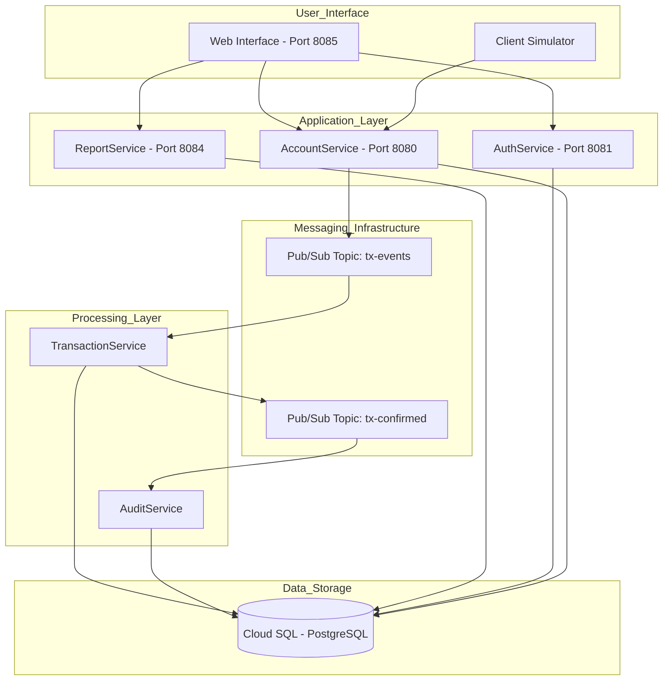
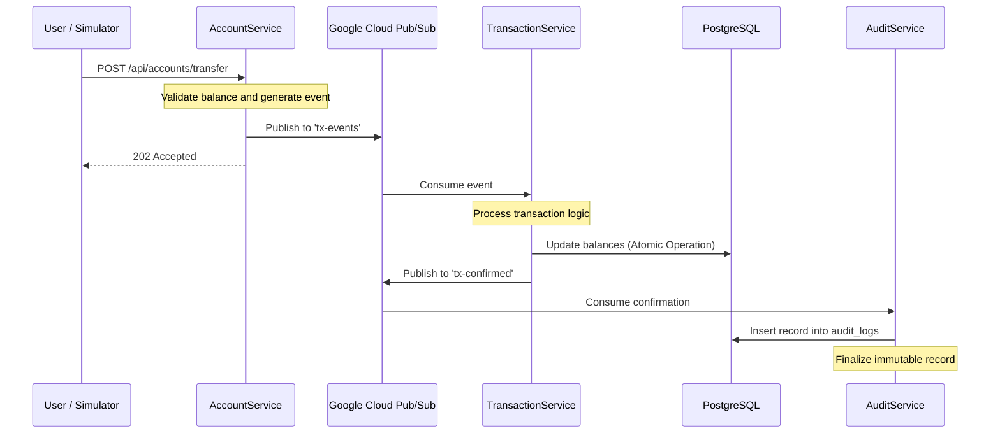
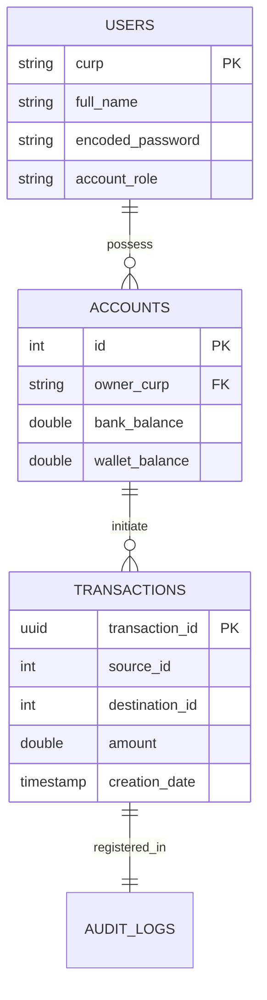

# Technical Documentation: Distributed Electronic Money Financial System

## 1. Overview
The Electronic Money Financial System (EMFS) is a distributed application designed to manage financial transactions through a microservices-based architecture. The system leverages asynchronous communication via Google Cloud Pub/Sub and ensures data persistence using Google Cloud SQL (PostgreSQL). It is built with Java 17 and Spring Boot.

---

## 2. System Architecture
The system follows an event-driven architectural pattern. Services are decoupled, allowing for independent scaling and improved fault tolerance.

### Component Diagram

---

## 3. Transaction Lifecycle
This section details the step-by-step process of a financial transaction, from the initial request to the final audit log.

### Sequence Diagram

---

## 4. Microservices Description

### 4.1 AuthService
Handles identity management and security.
- Technology: Spring Security and JSON Web Tokens (JWT).
- Responsibilities: User registration, authentication, and token issuance.
- Port: 8081.

### 4.2 AccountService
The entry point for user-facing financial operations.
- Responsibilities: Balance checks, deposit requests, and transfer initiations.
- Design: Acts as a producer for the messaging system to ensure non-blocking operations.
- Port: 8080.

### 4.3 TransactionService
The core business logic engine for processing payments.
- Responsibilities: Ensuring the integrity of balance updates and managing the state of transactions.
- Mechanism: Pulls/Pushes data from Pub/Sub to maintain eventual consistency.

### 4.4 AuditService
Provides a reliable history of all confirmed actions.
- Responsibilities: Logging successful transactions for compliance and security monitoring.
- Data: Writes to an append-only audit table.

### 4.5 ReportService
Facilitates data visualization for administrative purposes.
- Responsibilities: Querying the database for system-wide metrics and user statistics.
- Port: 8084.

---

## 5. Data Model
The system uses a relational schema designed for financial integrity.

### Entity-Relationship Diagram

---

## 6. Operation and Monitoring

### Client Simulator
A multi-threaded tool used to stress-test the system by simulating various users performing concurrent transactions. It allows tuning parameters such as thread count and transaction frequency.

### CPU Monitor
A terminal-based monitoring tool (TUI) utilizing the Lanterna library. It provides real-time hardware utilization metrics (CPU/RAM) across the distributed environment using the OSHI API.

### Infrastructure Management
The system is managed through several shell scripts:
- run-all-services.sh: Initializes all microservices.
- stop-all-services.sh: Terminates all running instances.
- check-services.sh: Verifies the health and availability of the system.

---
*Technical documentation prepared for the Final Project of Distributed Systems.*
