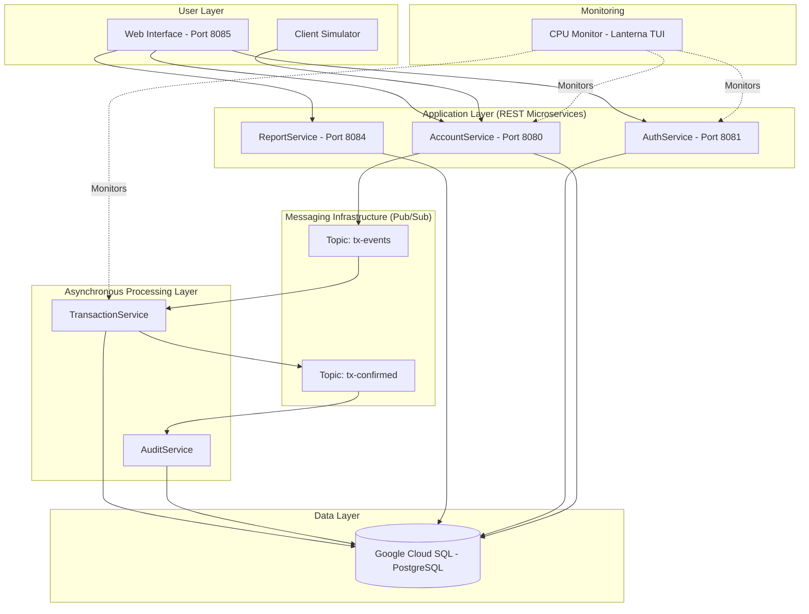
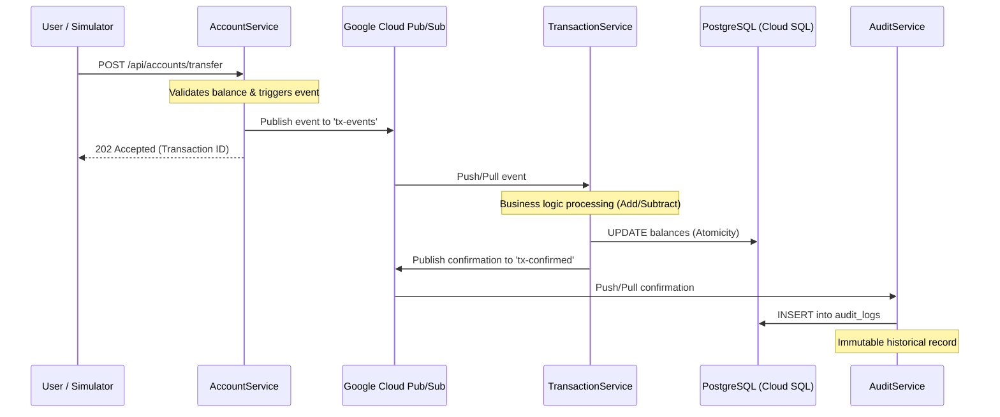
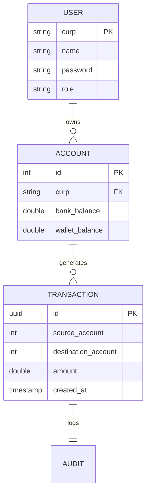

# Technical Documentation: Electronic Money Financial System (EMFS)

This document provides a detailed technical overview of the architecture, data flows, and components of the distributed microservices system for electronic money management.

---

## 1. System Architecture

The system follows an **Event-Driven Microservices** pattern using **Google Cloud Pub/Sub** as the central message bus.

### Architecture Diagram (Mermaid)

---

## 2. Transaction Lifecycle

This diagram illustrates the lifecycle of a financial operation (e.g., a transfer) from the user's request until it is confirmed and audited.

---

## 3. Component Breakdown

### 3.1 AuthService (Port 8081)
Responsible for perimeter security.
- **Technology:** Spring Security + JJWT.
- **Core Functions:** User registration, login, JWT token generation, and validation.
- **Security:** BCrypt hashing for password storage.

### 3.2 AccountService (Port 8080)
The entry point for all account-related operations.
- **Operations:** Balance inquiry, deposits, withdrawals, and transfers.
- **Role:** Acts as an event producer. It does not modify balances directly for critical operations; instead, it delegates to `TransactionService` via Pub/Sub to ensure scalability and fault tolerance.

### 3.3 TransactionService (Asynchronous)
The central processing engine.
- **Mechanism:** Listens to the `tx-events` topic.
- **Guarantees:** Ensures eventual consistency and exactly-once processing of transactions.
- **Scalability:** Supports multiple replicas to handle high-traffic bursts.

### 3.4 AuditService (Asynchronous)
Ensures full system traceability.
- **Mechanism:** Listens to the `tx-confirmed` topic.
- **Function:** Logs every completed transaction into an immutable audit table for reporting and security auditing purposes.

### 3.5 ReportService (Port 8084)
A read-optimized layer for the administration panel.
- **Core Functions:** Aggregates metrics (total system balance, transactions per minute, user balance rankings).

---

## 4. Data Model (ER)

The system utilizes a PostgreSQL relational database with the following schema:

---

## 5. Monitoring & Tools

### CPU Monitor (Lanterna TUI)
A terminal-based application that uses the `OSHI` library to retrieve hardware metrics in real-time. It provides a visual dashboard of the workload across all distributed microservices.

### Client Simulator
A load testing tool designed to simulate high-concurrency environments:
- `n`: Number of clients.
- `h`: Concurrent threads.
- `p`: Initial budget per client.
- `t`: Targeted transactions per minute.

---

## 6. Management Commands

| Action | Script |
|--------|--------|
| Start All Services | `./run-all-services.sh` |
| Stop All Services | `./stop-all-services.sh` |
| Check Service Status | `./check-services.sh` |
| Manual Testing Guide | `GUIA_PRUEBAS_MANUAL.md` |

---
*Documentation automatically generated by Gemini CLI for the Distributed Systems Final Project.*
