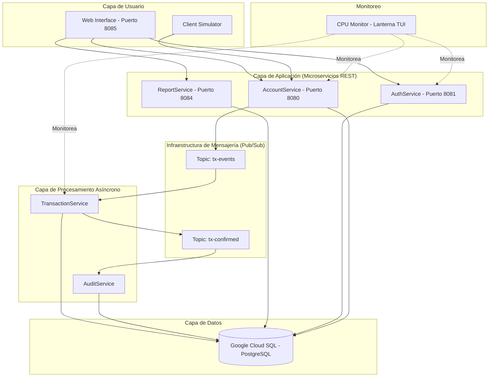
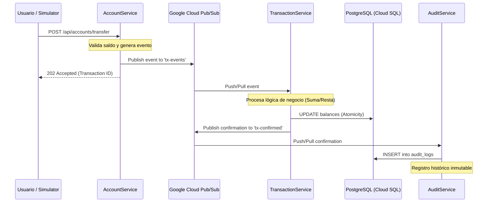
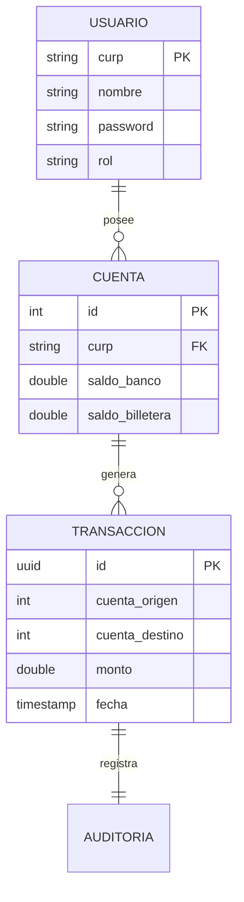

# Documentación Técnica: Sistema Financiero de Dinero Electrónico (SFDE)

Este documento proporciona una visión técnica detallada de la arquitectura, flujos de datos y componentes del sistema distribuido de microservicios para la gestión de dinero electrónico.

---

## 1. Arquitectura del Sistema

El sistema sigue un patrón de **Microservicios Event-Driven** (orientado a eventos) utilizando **Google Cloud Pub/Sub** como bus de mensajes central.

### Diagrama de Arquitectura (Mermaid)

---

## 2. Flujo de una Transacción

Este diagrama muestra el ciclo de vida de una operación financiera (ej. transferencia) desde que el usuario la solicita hasta que se confirma y audita.

---

## 3. Descripción de Componentes

### 3.1 AuthService (Puerto 8081)
Responsable de la seguridad perimetral.
- **Tecnología:** Spring Security + JJWT.
- **Funciones:** Registro de usuarios, login, generación y validación de tokens JWT.
- **Seguridad:** Uso de BCrypt para el hashing de contraseñas.

### 3.2 AccountService (Puerto 8080)
El "Entry Point" para todas las operaciones de cuenta.
- **Operaciones:** Consultar saldo, depósitos, retiros y transferencias.
- **Rol:** Actúa como productor de eventos. No modifica los balances directamente en operaciones críticas, sino que delega al `TransactionService` vía Pub/Sub para garantizar escalabilidad.

### 3.3 TransactionService (Asíncrono)
El motor de procesamiento central.
- **Mecánica:** Escucha el tópico `tx-events`.
- **Garantías:** Asegura la consistencia eventual y el procesamiento exacto de las transacciones.
- **Escalabilidad:** Puede tener múltiples réplicas para procesar ráfagas de transacciones.

### 3.4 AuditService (Asíncrono)
Garantiza la trazabilidad total del sistema.
- **Mecánica:** Escucha el tópico `tx-confirmed`.
- **Función:** Registra cada transacción finalizada en una tabla de auditoría inmutable para fines de reporte y seguridad.

### 3.5 ReportService (Puerto 8084)
Capa de lectura optimizada para el panel de administración.
- **Funciones:** Generación de métricas agregadas (saldo total del sistema, número de transacciones por minuto, balances por usuario).

---

## 4. Modelo de Datos (ER)

El sistema utiliza una base de datos relacional PostgreSQL con el siguiente esquema simplificado:

---

## 5. Monitoreo y Herramientas

### CPU Monitor (Lanterna TUI)
Aplicación de consola que utiliza la librería `OSHI` para obtener métricas de hardware en tiempo real. Permite visualizar la carga de trabajo de los diferentes microservicios distribuidos.

### Client Simulator
Herramienta de pruebas de carga que permite parametrizar:
- `n`: Número de clientes.
- `h`: Hilos concurrentes.
- `p`: Presupuesto inicial por cliente.
- `t`: Transacciones por minuto deseadas.

---

## 6. Comandos de Gestión

| Acción | Script |
|--------|--------|
| Levantar todo | `./run-all-services.sh` |
| Detener todo | `./stop-all-services.sh` |
| Verificar estado | `./check-services.sh` |
| Pruebas manuales | `GUIA_PRUEBAS_MANUAL.md` |

---
*Documentación generada automáticamente por Gemini CLI para el Proyecto Final de Sistemas Distribuidos.*
